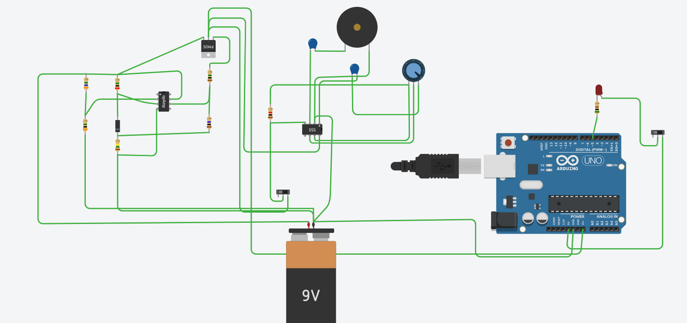

# MutliPurpose Aqua Refiner
Done By:
- Chandravaran Kunjeti (Team Leader)
- Saikumar Dande
- Aditya C
- Gayatri Tanksali

This repository contains the final CAD models as well as the final poster and video submission

## Block Diagram
Below is a picture of the block diagram of the system.

There are mainly 2 components. 
- First is the filtering structure and the different stages the water has to go through to get filtered.
- Second is the dynamo part where electricity is generated using a gear system.

## Side View
Here is a picture of the gear system of the device.

## Top View
Here is a picture of the top view.

## Bottom View 
Here is a picture of the bottom view.

## Side projection
The 2D side projection of the device is shown below.

Section 1 is the part kept in water which contains a centrafugal fan.
Section 2 contains the filter, and water storage unit, as well the dynamo 
Section 3 is where all the electronic components are.

## Thinkercad Circuit 
This is an image which contains the thinkercad arduino simulation of the circuitry going to be used

